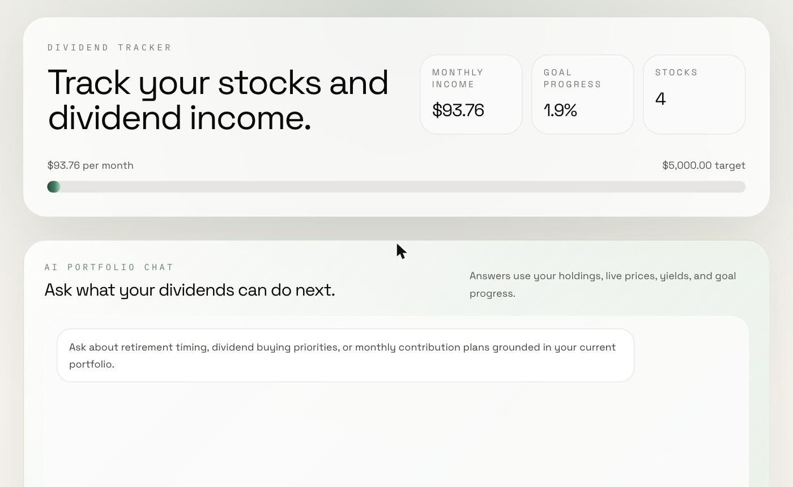
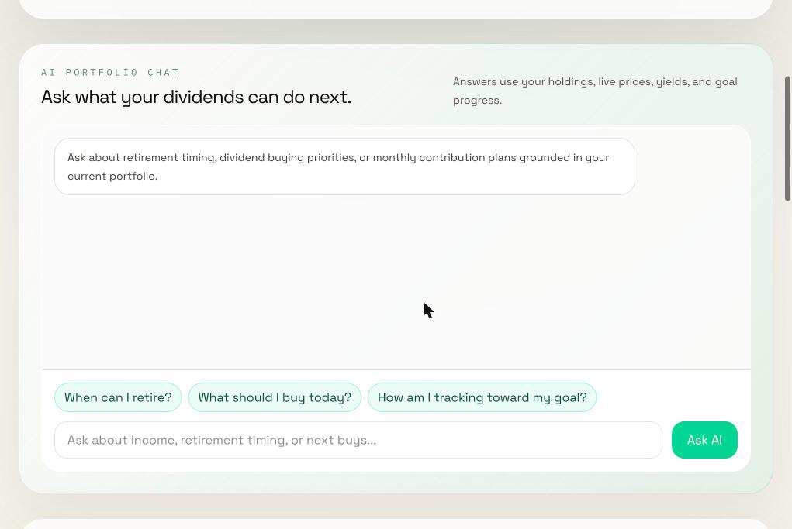
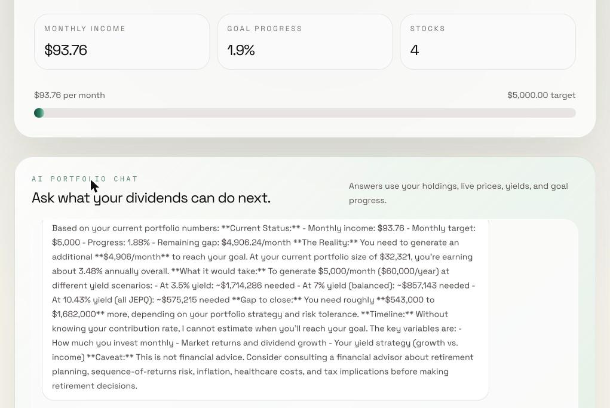

# Dividend Tracker

[](https://github.com/sonnymay/dividend-tracker/actions/workflows/ci.yml) [](https://www.python.org/)
[](https://fastapi.tiangolo.com/)
[](LICENSE)
[](https://dividend-tracker-pi-navy.vercel.app)

> Track your dividend portfolio's yield, payout history, and breakdown — without juggling five brokerage tabs.

**🔗 Live demo:** [dividend-tracker-pi-navy.vercel.app](https://dividend-tracker-pi-navy.vercel.app)

Built to track a real dividend portfolio targeting **$5,000/month passive income** for early retirement.

---

## Table of contents

- [Why this exists](#why-this-exists)
- [Features](#features)
- [Stack](#stack)
- [Architecture](#architecture)
- [Screenshots](#screenshots)
- [Local development](#local-development)
- [Roadmap](#roadmap)
- [Contributing](#contributing)
- [Disclaimer](#disclaimer)
- [License](#license)

---

## Why this exists

Most portfolio dashboards bury dividend data three clicks deep, or assume you only care about share price. As a long-term dividend investor I wanted answers to three questions at a glance:

- **What's my forward yield** across the whole portfolio?
- **When am I getting paid, and how much?**
- **Which positions are actually carrying the income?**

Dividend Tracker exists to answer those three questions on one screen.

---

## Features

- 📊 **Portfolio overview** — total value, cost basis, forward yield
- 📅 **Payout history** — past distributions visualized over time
- 🤖 **AI portfolio chat** — ask questions about your holdings via natural language
- 📈 **Forward yield projections** — estimate future income based on current positions
- 🔍 **Stock search** — add any ticker with live data from yfinance
- 🌙 **Dark mode** — easy on the eyes for late-night portfolio reviews

## Roadmap

- [ ] CSV import/export for portfolio data
- [ ] Dividend reinvestment (DRIP) calculator
- [ ] Tax year summary and qualified vs. ordinary dividend breakdown
- [ ] Email alerts for upcoming ex-dividend dates
- [ ] Multi-currency support
- 🔔 **Upcoming payouts** — ex-div and pay dates so you stop missing them
- 🥧 **Position breakdown** — yield, weight, and income contribution per holding
- 🤖 **AI Portfolio Chat** — ask retirement-timing, next-buy, and goal-tracking questions grounded in your holdings
- 📡 **Live price + dividend data** pulled from Yahoo Finance via `yfinance`

---

## Stack

| Layer    | Tech                                                  |
|----------|-------------------------------------------------------|
| Frontend | React 19, Vite, TypeScript, Recharts, Tailwind CSS v4 |
| Backend  | FastAPI (Python 3.11+), Pydantic Settings             |
| Data     | yfinance (Yahoo Finance) · Supabase                   |
| Hosting  | Vercel (frontend) · Render (backend)                  |

---

## Architecture

```
┌───────────────┐      ┌──────────────┐      ┌──────────────┐
│  React + Vite │ ───▶ │   FastAPI    │ ───▶ │   yfinance   │
│   (Vercel)    │      │   (Render)   │      │  + Supabase  │
└───────────────┘      └──────────────┘      └──────────────┘
```

FastAPI handles ticker lookups via `yfinance` for live price and dividend history, then persists user holdings in Supabase. Recharts renders payout history and portfolio breakdown on the client.

---

## Screenshots

### Dashboard view


### AI Portfolio Chat


### AI response — "When can I retire?"


---

## Local development

```bash
docker compose up --build
```

Docker starts the API at `http://localhost:8000`. Create `backend/.env` from `backend/.env.example` before first run.

### Prerequisites

- Python 3.11+
- Node.js 20+
- A Supabase project (free tier is fine)

### Backend

```bash
cd backend
python -m venv .venv && source .venv/bin/activate
pip install -r requirements-dev.txt
pre-commit install
cp .env.example .env   # then fill in SUPABASE_URL and SUPABASE_KEY
uvicorn app.main:app --reload
```

API runs at `http://localhost:8000`. Interactive docs at `/docs`.

For Render deploys, set `SUPABASE_URL` and `SUPABASE_KEY` on the backend web service.
This app does not use `DATABASE_URL`. Use `/health/dependencies` to verify the backend
can reach Supabase after deploy.

### Frontend

```bash
cd frontend
npm install
npm run dev
```

App runs at `http://localhost:5173`.

---

## Roadmap

- [ ] DRIP simulation (reinvested vs cash payout)
- [ ] Dividend growth rate (1y / 3y / 5y CAGR)
- [ ] Sector + geography breakdown
- [ ] CSV import from broker statements
- [ ] Dividend safety / payout ratio flags
- [ ] Tests + CI (GitHub Actions)
- [ ] Publish backend as a PyPI package

---

## Contributing

Issues and PRs welcome — particularly around new data sources, additional chart types, or broker-import formats. Open an issue before sending large PRs.

---

## Disclaimer

This project is for **personal portfolio tracking and educational purposes only**. It is not financial, investment, tax, or legal advice. Dividend and price data are provided by Yahoo Finance via `yfinance` and may be delayed, incomplete, or incorrect. Do your own research and consult a licensed advisor before making investment decisions.

---

## License

[MIT](LICENSE) © Sonny May
